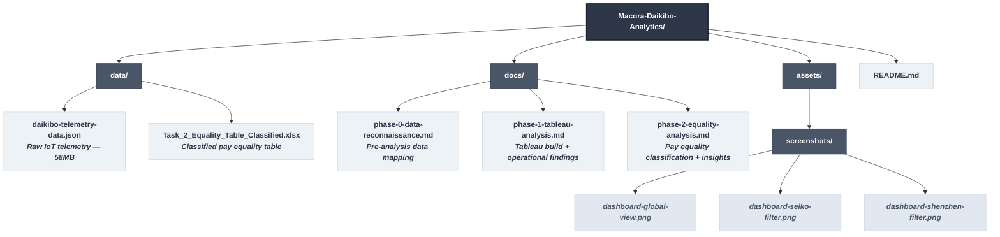

<div align="center">

# 🏭 Macora Industries — Operational Intelligence & Pay Equity Audit
### Deloitte-Style Data Analytics Engagement | End-to-End Portfolio Project


</div>

---

## 📌 Executive Summary

This end-to-end data analytics audit delivers a comprehensive operational and organizational health assessment for **Daikibo Industrials**, a manufacturing subsidiary of **Macora Industries** operating across four international facilities in Japan, Germany, and China.

### 🔍 Workstream 1: Industrial Asset Risk & Downtime Intelligence
Analyzed **~260,000 continuous IIoT machine logs (58MB nested JSON)** to isolate systemic downtime vulnerabilities. By transforming raw, binary machine states into quantified operational metrics, this stream maps critical mechanical fleet failures and ranks factory-floor performance to optimize maintenance intervals and minimize revenue leakage.

### ⚖️ Workstream 2: Forensic Compensation Equity Auditing
Engineered a programmatic conditional logic framework over global workforce payroll data to quantify structural gender pay disparities. This audit isolates systemic salary deviations, mapping equity indexes across corporate hierarchies to protect the organization against talent retention drops, brand erosion, and compliance risks.

### 🎯 The Strategic Bottom Line
Rather than analyzing operations and payroll in silos, this intelligence report provides Daikibo’s executive leadership with a unified, data-driven roadmap. It enables the company to execute surgical mechanical interventions while simultaneously restructuring executive-level corporate governance to maximize cultural health and floor productivity.

---

## 🧭 Project Structure

This production-ready repository is structured logically to separate raw data assets, phase-based documentation logs, and presentation layers:


## 🔍 Workstream 1 — Factory Telemetry & Downtime Analysis

### 🎯 Business Problem
Daikibo Industrials experienced recurring, undocumented production drops across its global operations. Management lacked centralized operational visibility to track real-time machinery health, quantify bottom-line temporal losses, or determine whether operational bottlenecks stemmed from localized mechanical asset failures or systemic regional management deficiencies.

### 📊 Data Architecture & Parsing Challenge
* **Source Asset:** `daikibo-telemetry-data.json` (260,000+ IoT event transmissions).
* **Ingestion Risk:**  Standard flat-text ingestion methods suffer from structural data truncation when encountering deeply nested JSON structures containing location and device metadata arrays.
* **Data Resolution:** Conducted a structural data reconciliation within Tableau Desktop by explicitly parsing hierarchical schema levels, anchoring rows to the lowest telemetry branch, and casting raw string logs into explicit time-intelligence dimensions.

### ⚙️ Technical Methodology & Feature Engineering

1. **Hierarchical Schema Resolution:** 
   Preserved the relational integrity of nested location coordinates and device metadata objects by mapping data resolution boundaries at the most granular telemetry branch.

2. **Time-Intelligence Metric Engineering:** 
   Transformed qualitative, binary machine states into summable financial and operational metrics by engineering a downtime-duration dimension based on the sensor's native 10-minute polling frequency:


    ```text
       IF [Status] = "unhealthy" THEN 10 ELSE 0 END
    ```
3. **Interactive Topology Design:**
    Built a centralized executive dashboard applying synchronized action filters. The interface allows cross-functional stakeholders to isolate specific geographical manufacturing facilities, triggering automated sub-queries that isolate micro-level device performance profiles.
---

### 📈 Core Findings

#### Global Plant Downtime Risk Profile

| Rank | Factory | Location | Total Downtime | Risk Profile |
| :---: | --- | --- | :---: | --- |
| **1** | Daikibo Factory Seiko | Osaka, Japan | **480 mins** | 🔴 Critical Risk |
| **2** | Daikibo Shenzhen | Shenzhen, China | **420 mins** | 🔴 Critical Risk |
| **3** | Daikibo Factory Meiyo | Tokyo, Japan | **110 mins** | 🟡 Moderate Risk |
| **4** | Daikibo Berlin | Berlin, Germany | **20 mins** | 🟢 Operational Benchmark |

#### Fleet Asset Breakdown

| Factory | Device Type | Downtime (mins) | Diagnostics & Root Cause |
| --- | --- | :---: | --- |
| **Seiko** | LaserWelder | 480 | 100% of plant failure stems from a single machine class. |
| **Shenzhen** | LaserCutter | 390 | **Systemic Culture Risk:** Failure spread across 4 distinct machine classes simultaneously. |
| | ConveyorBelt / CNC / SpotWelder | 30 | Indicates potential localized power, maintenance, or environmental issues. |
| **Meiyo** | HeavyDutyDrill / LaserCutter | 110 | **Early Warning Threshold:** Dual-source failure patterns. |
| **Berlin** | Furnace | 20 | **Peak Operational Excellence:** Minimal incident rate across entire month. |

---

### 🧠 Strategic Operational Insights

* **Surgical Capital Allocation (Seiko):** Operations do not require a costly, facility-wide capital overhaul in Osaka. Targeted mechanical intervention or replacement of the LaserWelder fleet eliminates 100% of Seiko's production risk.
* **Systemic Infrastructure Risk (Shenzhen):** Downtime in the Shenzhen facility spans four entirely distinct machine classifications. This operational profile indicates systemic floor-level failures, such as unoptimized maintenance intervals, deficient cooling infrastructure, or local workforce training gaps.
* **Global Technology Threat Vector:** Laser-based assets (LaserWelder and LaserCutter) represent the primary operational vulnerability across global facilities, accounting for 910 minutes (88.3%) of cumulative enterprise downtime.

---

### 🖥️ Dashboard Interface

#### Global Enterprise View


#### Drill-Down Matrix: Seiko Facility Focus


---

## ⚖️ Workstream 2 — Pay Equity Forensic Analysis

### 🎯 Business Problem

Following formal internal staff complaints regarding systemic gender bias, Daikibo’s corporate governance team initiated a comprehensive payroll audit. The objective was to transform raw compensation variance metrics (ranging from -100 to +100, where 0 represents absolute equity and negative values isolate female under-compensation) into a compliant, mathematically validated risk-classification framework to isolate corporate liability.

### ⚙️ Forensic Logic Design & Exception Handling

To evaluate workforce equity vectors without generating logical compilation errors or index fragmentation from negative variance variables, I implemented a nested conditional execution architecture in Excel.

The algorithmic execution handles boundary limits by validating the tight, continuous internal parity window first, before evaluating diverging positive/negative variance limits:

```excel
=IF(AND(C2>-10, C2<10), "Fair", IF(OR(C2<=-20, C2>=20), "Highly Discriminative", "Unfair"))
```

**Mathematical Boundary Containment:** The `AND` expression establishes a strict statistical control zone for variance fluctuating within acceptable organizational parity thresholds (±10).

**Divergent Variance Capture:** The `OR` string mitigates logic fragmentation by grouping extreme negative and positive variants (severe under- and over-compensation) into a single actionable risk vector.

**Audit-Trail Integrity Preservation:** Zero data rows were trimmed, imputed, or dropped indicating excellent data governance and an healthy data ecosystem. The analytical logic processes the full payroll population to ensure uncompromised audit compliance.

## 📊 Classification Summary

| Factory | 🟢 Fair Roles | 🟡 Unfair Roles | 🔴 Highly Discriminative | Corporate Governance Profile |
|:---|:---:|:---:|:---:|:---|
| **Daikibo Meiyo** | 4 | 3 | 4 | 🚨 Severe Executive Disparity |
| **Daikibo Seiko** | 5 | 3 | 3 | ⚠️ Compounding Operational/Culture Risk |
| **Daikibo Shenzhen** | 5 | 1 | 2 | 📉 Targeted Disparity |
| **Daikibo Berlin** | 5 | 3 | 0 | ✅ Equitable Model |
| **TOTAL** | **19** | **10** | **9** | **Systemic Negative Bias** |

---

## 🧠 Strategic Forensic Insights

* **The Executive "Glass Ceiling" Driver:** Compensation disparity is structurally isolated rather than universally distributed. `Highly Discriminative` classifications cluster almost exclusively within executive management bands (C-Suite, VP, and Director tiers), while floor-level operational roles track near absolute equity. This represents a systemic **leadership promotion and salary-benchmarking gap** rather than a broad, hourly payroll issue.

* **Meiyo Governance Deficit & Legal Exposure:** The Meiyo facility's executive tier demonstrates severe, concentrated gender pay disparity, with the C-Suite scoring **-25** and the VP tier tracking at **-26**. Divergences of this magnitude indicate a critical historic absence of compensation committee oversight and present significant institutional compliance and regulatory liabilities.

* **Compounding Enterprise Exposure (Seiko):** The Seiko facility represents the organization's highest risk profile, simultaneously tracking severe mechanical infrastructure failures in Workstream 1 and critical compensation liabilities in Workstream 2. This operational-cultural failure nexus serves as an immediate leading indicator for workforce attrition, systemic talent drain, and acute corporate litigation risks.

---

## 🛠️ Unified Architecture & Tech Stack

| Tool | Domain Layer | Strategic Purpose |
|:---|:---|:---|
| **Tableau Desktop** | Business Intelligence & Visualization | Parsing heavy nested JSON hierarchies, time-intelligence calculated measures, and user-driven interactive filtering matrices. |
| **Microsoft Excel** | Forensic Data Engineering | Logical condition structuring, multi-variable mathematical nesting, and data auditing. |
| **VS Code & Markdown** | Documentation Engine | Creating comprehensive, engineering-first technical mapping notes and executive briefs. |
| **Git & GitHub** | Version Control & Publishing | Maintaining file integrity, tracking project iterations, and publishing clean documentation. |

---

## 🎯 Executive Call to Action

| Priority | Targeted Action Item | Stakeholder Owner |
|:---:|:---|:---|
| **1. IMMEDIATE** | Deploy specialized vendor technicians to replace/recalibrate Seiko’s LaserWelder line. | VP of Operations |
| **2. IMMEDIATE** | Enact an immediate compensation freeze and forensic review of executive salary bands at Meiyo to correct systemic C-Suite disparities. | Global HR & Compensation Committee |
| **3. SHORT-TERM** | Initiate floor-level root-cause infrastructure audits in Shenzhen to mitigate multi-asset operational downtime. | Shenzhen Plant Manager |
| **4. MEDIUM-TERM** | Operationalize the Berlin facility's compensation and maintenance playbooks as the baseline blueprint for global standardization. | Chief Operating Officer (COO) |

---


## 👤 Principal Consultant

**Oluwadunmininu Deborah Oluremi**  
*Data Professional & Operations Analytics Specialist*  

This portfolio case study demonstrates the rigorous application of enterprise business intelligence (BI) frameworks and forensic data engineering methodologies. Structured to mirror a high-stakes corporate advisory engagement, this project adheres to the data-auditing and reporting standards expected within top-tier operational consulting practices like Deloitte Australia.

[](https://linkedin.com/in/dunmininu)
[](https://github.com/Dunmxie)
