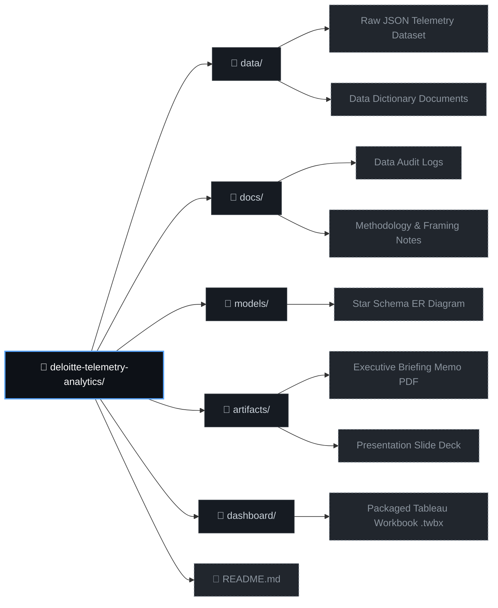

# 🏭 Macora Industries — Operational Intelligence & Pay Equity Audit
### Deloitte-Style Data Analytics Engagement | End-to-End Portfolio Project

---

## 📌 Executive Summary

> This project simulates a real consulting engagement where I acted as a junior 
> Data Analyst at **Macora Industries**, tasked with delivering two critical 
> diagnostic workstreams for our client **Daikibo Industrials** — a global 
> manufacturing firm operating across 4 international factory locations.
>
> **Workstream 1 — Operational Risk:** Identify which factory locations and 
> machine types carry the highest downtime risk using IIoT telemetry data.
>
> **Workstream 2 — Pay Equity Forensics:** Detect structural gender pay 
> disparities across Daikibo's workforce using forensic classification methodology.

---

## 🧭 Project Structure

---

## 🔍 Workstream 1 — Factory Telemetry & Downtime Analysis

### Business Problem
<!-- TODO: Fill in after Phase 2 — describe the client's question in business language -->

### Data Overview
<!-- TODO: Fill in after Phase 1 — dataset size, structure, date range, fields -->

### Data Quality Audit
<!-- TODO: Link to docs/data-audit-log.md and summarise key findings -->

### Methodology
<!-- TODO: Fill in after Phase 2 — explain Unhealthy calculated field logic -->

### Key Findings
<!-- TODO: Fill in after Phase 3 — factory ranking, worst machine types -->

### Dashboard Preview
<!-- TODO: Insert screenshot after Phase 3 -->

> 🔗 [View Live Interactive Dashboard on Tableau Public](#) <!-- TODO: Add link -->

---

## ⚖️ Workstream 2 — Pay Equity Forensic Analysis

### Business Problem
<!-- TODO: Fill in after Task 2 briefing -->

### Methodology
<!-- TODO: Fill in after Task 2 — explain classification logic -->

### Key Findings
<!-- TODO: Fill in after Task 2 -->

---

## 📐 Data Model

<!-- TODO: Insert star schema diagram after Phase 1 modelling -->

---

## 🛠️ Tools & Technologies

| Tool | Purpose |
|------|---------|
| Tableau Public | Interactive dashboard & data visualisation |
| Microsoft Excel | Forensic pay equity classification |
| Python | Data profiling & audit automation |
| Git & GitHub | Version control & portfolio publishing |

---

## 📁 Deliverables

| Deliverable | Location | Status |
|-------------|----------|--------|
| Data Audit Log | `docs/data-audit-log.md` | ✅ Complete |
| Star Schema Diagram | `models/` | 🔄 In Progress |
| Tableau Dashboard | `dashboard/` | 🔄 In Progress |
| Pay Equity Analysis | `data/` | ⏳ Pending |
| Executive Briefing | `artifacts/` | ⏳ Pending |

---

## 💡 Key Takeaways & Professional Reflections
<!-- TODO: Fill in at the very end — what this project taught you, 
     what a real consultant would recommend to the client next -->

---

## 👤 Author

**Oluwadunmininu Deborah Oluremi**  
Data Analyst | Macora Industries Engagement Simulation  

---

Built as a production-grade portfolio project simulating a Deloitte consulting engagement via Forage.

