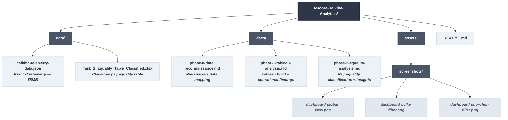

# Daikibo Industries — Operations & Equity Intelligence Report
### An Independent Consulting Analysis | May 2021 Telemetry Data

---

## Executive Summary

Daikibo Industries operates 4 global manufacturing facilities 
across Japan, Germany, and China. This project delivers two 
independent but complementary analyses commissioned to address 
operational and organisational challenges facing the business.

**Analysis 1: Operational Downtime Intelligence**
Using one month of IoT telemetry data from 9 machine types 
across all 4 facilities, this analysis identifies which factory 
experienced the most production downtime and which machine types 
are responsible giving operations leadership a precise, 
data-driven target for intervention.

**Analysis 2: Gender Pay Equality Classification**
Using forensic equality scores generated from Daikibo's internal 
compensation data, this analysis classifies every job role in 
every facility into one of three categories; Fair, Unfair, or 
Highly Discriminative and surfaces the structural patterns 
driving gender pay inequality across the organisation.

Together, these analyses position Daikibo to make faster, more 
confident decisions on two of its most pressing operational and 
organisational challenges.

---

## The Analyst

**Dunmxie**; Operations & Data Consultant

Specialising in manufacturing intelligence, operational 
diagnostics, and organisational equity analysis. This project 
was completed as part of the Deloitte Australia Data Analytics 
Virtual Program (Forage), and is presented here as a 
demonstration of applied consulting methodology on real 
industrial datasets.

📎 [Portfolio](https://dunmxie.github.io) 

---

## Project Structure



---

## Analysis 1: Operational Downtime Intelligence

### Background
Daikibo deployed IoT sensors across all 4 factories, with 9 
machine types each transmitting a status message every 10 
minutes throughout May 2021. Each message carries one of two 
statuses; `healthy` or `unhealthy`. One unhealthy message 
represents 10 minutes of potential production downtime.

### Tool
**Tableau Desktop** for interactive dashboard development, 
cross-factory filtering, and visual pattern identification 
across ~260,000 telemetry records.

### Methodology

1. **Data Import**:
The 58MB nested JSON file was imported into Tableau with all 
schema levels explicitly expanded. The `location` and `data` 
objects are nested; a silent import without schema expansion 
drops both entirely.

2. **Calculated Field**
A calculated measure field `Unhealthy` was created:
```
IF [Status] = "unhealthy" THEN 10 ELSE 0 END
```
This converts binary status text into summable downtime minutes;
the foundation of every visualisation.

3. **Dashboard**
Two bar charts built and combined into an interactive dashboard:
- **Down Time per Factory** ranks all 4 facilities by total downtime
- **Down Time per Device Type** ranks all 9 machine types by downtime

Chart 1 was set as a filter, clicking any factory bar updates 
Chart 2 to show only that facility's machine breakdown.

### Findings

#### Factory Downtime Rankings

| Rank | Factory | Location | Total Downtime |
|---|---|---|---|
| 1 | Daikibo Factory Seiko | Osaka, Japan | **480 mins** |
| 2 | Daikibo Shenzhen | Shenzhen, China | **420 mins** |
| 3 | Daikibo Factory Meiyo | Tokyo, Japan | **110 mins** |
| 4 | Daikibo Berlin | Berlin, Germany | **20 mins** |

#### Full Factory-Device Breakdown

| Factory | Device Type | Downtime (mins) | Factory Total |
|---|---|---|---|
| Seiko | LaserWelder | 480 | **480** |
| Shenzhen | LaserCutter | 390 | **420** |
| Shenzhen | ConveyorBelt | 10 | |
| Shenzhen | CNC | 10 | |
| Shenzhen | SpotWelder | 10 | |
| Meiyo | HeavyDutyDrill | 70 | **110** |
| Meiyo | LaserCutter | 40 | |
| Berlin | Furnace | 20 | **20** |

#### Global Device Type Rankings

| Device Type | Global Downtime (mins) | Risk Level |
|---|---|---|
| LaserWelder | 480 | 🔴 Critical |
| LaserCutter | 430 | 🔴 Critical |
| HeavyDutyDrill | 70 | 🟡 Moderate |
| Furnace | 20 | 🟡 Low |
| SpotWelder | 10 | 🟢 Minimal |
| ConveyorBelt | 10 | 🟢 Minimal |
| CNC | 10 | 🟢 Minimal |
| MetalPress | 0 | ✅ Zero failures |
| AirWrench | 0 | ✅ Zero failures |

### Key Insights

**Seiko: High Impact, Targeted Problem**
480 minutes. One machine type. One factory. LaserWelder is the 
sole failure source in Daikibo's worst performing facility. 
High business impact, low diagnostic complexity. A targeted 
intervention service, recalibrate, or replace the LaserWelder 
fleet in Seiko addresses the entire problem.

**Shenzhen: Systemic Risk**
420 minutes across 4 device types. LaserCutter dominates at 
390 minutes but 3 additional machines show early failure signals. 
Multiple failure sources in one facility point to a systemic 
issue maintenance culture, environmental conditions, or power 
instability rather than isolated machine faults.

**Laser Technology: A Cross-Factory Fleet Risk**
LaserWelder fails in Seiko. LaserCutter fails in Shenzhen and 
Meiyo. Two laser-based machine types failing across 3 of 4 
global facilities. This pattern warrants a fleet-wide vendor 
audit and maintenance protocol review.

**Berlin: The Operational Benchmark**
20 minutes of downtime from a single Furnace event across an 
entire month. Berlin's operational practices deserve study as 
an internal benchmark for the other 3 facilities.

**Meiyo: Early Warning**
Two independent failure sources across 110 minutes combined. 
Not critical today but dual-source failure patterns 
historically precede facility-wide deterioration.

### Dashboard Screenshots

**Global View — All Factories**


**Seiko Filtered — LaserWelder Isolated**


**Shenzhen Filtered — Multi-Device Breakdown**


---

## Analysis 2: Gender Pay Equality Classification

### Background
Following internal complaints about gender-based salary 
disparities, Daikibo's Forensic Tech team built an algorithm 
to quantify pay equality for every job role across all 
facilities. The output is an equality score per role per 
factory an integer between -100 and +100 where 0 is perfect 
parity. Negative scores indicate women are compensated below 
men in equivalent roles.

### Methodology

**Classification framework applied:**

| Class | Condition | Interpretation |
|---|---|---|
| 🟢 Fair | Score > -10 AND < +10 | Acceptable pay parity |
| 🟡 Unfair | Score ≤ -10 AND > -20 OR ≥ +10 AND < +20 | Meaningful disparity |
| 🔴 Highly Discriminative | Score ≤ -20 OR ≥ +20 | Severe — immediate action required |

**Excel formula applied:**
```excel
=IF(AND(C2>-10,C2<10),"Fair",IF(OR(C2<=-20,C2>=20),"Highly Discriminative","Unfair"))
```

### Findings

#### Classification Summary

| Factory | 🟢 Fair | 🟡 Unfair | 🔴 Highly Discriminative |
|---|---|---|---|
| Daikibo Factory Meiyo | 4 | 3 | 4 |
| Daikibo Factory Seiko | 5 | 3 | 3 |
| Daikibo Berlin | 5 | 3 | 0 |
| Daikibo Shenzhen | 5 | 1 | 2 |
| **Total** | **19** | **10** | **9** |

### Key Insights

**The Pay Gap Is a Leadership Pipeline Problem**
Highly Discriminative classifications cluster almost exclusively 
at senior levels C-Level, VP, Director, and Manager tiers. 
Ground-level roles score within Fair range in the majority of 
cases. This is not a company-wide pay gap. It is a leadership 
compensation gap and that distinction changes the recommended 
fix entirely.

**Meiyo Is the Most Severe Offender**
C-Level at -25 and VP at -26 inequality at the very top of 
a facility's hierarchy signals a governance failure, not an 
HR oversight. Pay decisions at the most senior levels have 
gone unscrutinised for an extended period.

**Berlin Is the Internal Benchmark**
The only facility with zero Highly Discriminative 
classifications. Berlin's ground-level compensation is 
effectively equitable. It should serve as the internal 
standard for restructuring other facilities.

**Seiko Carries a Compounding Risk**
Highest operational downtime in Analysis 1. Three Highly 
Discriminative pay classifications in Analysis 2. A facility 
under operational stress with documented leadership pay 
inequality is a predictable source of turnover, low morale, 
and reduced productivity. Both problems demand simultaneous 
attention.

**All Scores Are Negative — A Systemic Direction**
Every score in the dataset is negative or marginally positive. 
There is no factory where women earn above parity in any role. 
The problem is systemic and unidirectional across the entire 
organisation.

### Recommendations

| Priority | Action | Target |
|---|---|---|
| Immediate | Audit C-Level and VP compensation at Meiyo | Meiyo leadership |
| Immediate | Review Manager-tier pay across Seiko | Seiko HR |
| Short-term | Implement pay band transparency at all facilities | All factories |
| Medium-term | Use Berlin as internal benchmark for pay restructuring | Global HR |
| Ongoing | Re-run equality algorithm quarterly to track progress | Forensic Tech |

---

## Cross-Analysis Observation

Seiko appears as the highest-risk facility in both analyses  
most operational downtime and multiple severe pay inequality 
classifications. Berlin appears as the strongest facility in 
both lowest downtime and cleanest pay equality profile.

This correlation is not coincidental. Facilities with equitable, 
well-managed internal cultures tend to operate more efficiently. 
The data suggests Daikibo's leadership should look at Berlin 
not just as an operational benchmark, but as an organisational 
one.

---

## Tools & Methods

| Tool | Purpose |
|---|---|
| Tableau Desktop | IoT telemetry visualisation and dashboard development |
| Microsoft Excel | Pay equality classification and formula application |
| VS Code | Data reconnaissance, documentation, version control |
| Git & GitHub | Project versioning and portfolio presentation |
| JSON (58MB) | Raw telemetry source; nested schema, ~260K records |

---

## Methodology Notes

- All downtime calculations derive from a single calculated 
  field — `Unhealthy` converting binary status signals into 
  quantified minutes
- Classification boundaries are exclusive of ±10 based on 
  example verification in the original brief
- Temperature data (`data.temperature`) present in the 
  telemetry dataset was noted but falls outside the current 
  engagement scope it represents an opportunity for a 
  predictive maintenance extension
- No data was modified, imputed, or excluded during either 
  analysis

---

*Analysis completed: May 2021 data | Documented: 2026*  
*Deloitte Australia Data Analytics Virtual Program: Forage*


This is what is currently in my reaadme file 


What can be done to make it better?